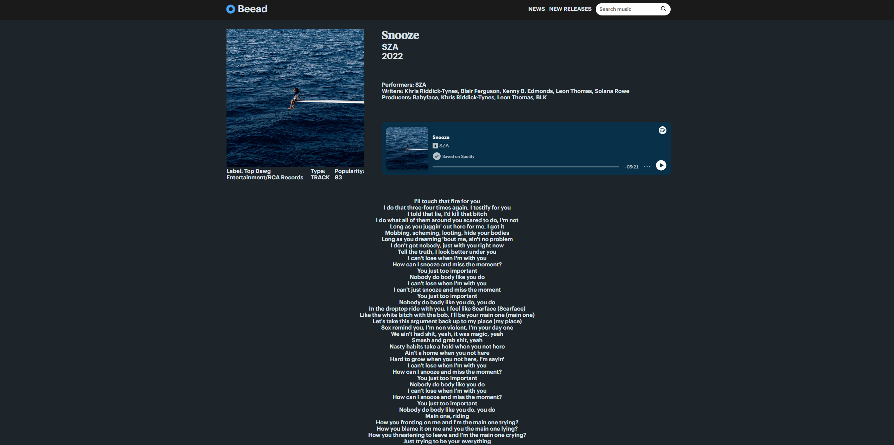

# Beead Music

A web application where users can discover, listen to, and read articles on music.

## Description

This project was built using React.js, Next.js, HTML, and CSS.

I created this project to continue practicing my web development skills and familiarize myself with Next.js 14 (App Router). I decided on using Next.js because through reading React documentation, it seems that the devs are supporting Next.js as the main framework of choice. I also wanted to practice CSS fundamentals and responsive web design without using external libraries.

### Design

- Created a minimalistic and retro-inspired front end using React.js
- Used latest version of Next.js which utilizes the App Router
- Pulled music data from Spotify API and latest news on music from GNews
- Utilized spotify player to include a built music player
- Responsive web design

### Features

- Users can search for artists, albums, and tracks using the search bar
- View detailed information on tracks and albums such as writers, composers, lyrics, release dates, track lists, and labels
- Read about artists through the artist page which has their descriptions, albums, and top trending tracks
- Listen to albums and tracks directly through the built-in music player
- See latest releases in music through the new releases tab
- Read the latest music news through the news tab
- Dropdown menu for smaller screens/mobile devices

In the future, I plan to include a backend portion that would allow for features like user creation, rating songs/albums, creating tier lists, and allowing users to write comments.

## Installation

These instructions will get you a local copy of this project running on your machine for development and testing purposes.

1. Clone this project

2. Install Node.js and npm: https://nodejs.org/en/download

3. Create a .env.local file in the app root directory

4. Within the .env.local file create 5 variables named:NEXT_PUBLIC_CLIENT_ID,NEXT_PUBLIC_CLIENT_SECRET,NEXT_PUBLIC_RAPID_API_KEY, NEXT_PUBLIC_RAPID_API_HOST, NEXT_PUBLIC_NEWS_G_NEWS_API_KEY

5. Visit https://rapidapi.com/hub and create a free account

6. Subscribe to this api service at https://rapidapi.com/Glavier/api/spotify23 with the free basic plan

7. Set your NEXT_PUBLIC_RAPID_API_KEY='X-RapidAPI-Key' and NEXT_PUBLIC_RAPID_API_HOST= 'X-RapidAPI-Host'

8. Head over to https://developer.spotify.com/documentation/web-api/tutorials/getting-started and follow their instructions to retrieve your Client ID and Client Secret

9. Set your NEXT_PUBLIC_CLIENT_ID='Client ID' and NEXT_PUBLIC_CLIENT_SECRET='Client Secret'

10. Create an account at https://gnews.io/ and find your API key at the dashboard

11. Set NEXT_PUBLIC_NEWS_G_NEWS_API_KEY=your API key

12. In the project directory run: `npm install` to install all dependencies

13. To start the application run: `npm run dev`

14. Open it in http://localhost:3000 to view in browser.

## Authors

- [Brandon Tieu](https://github.com/brandontieu626)
